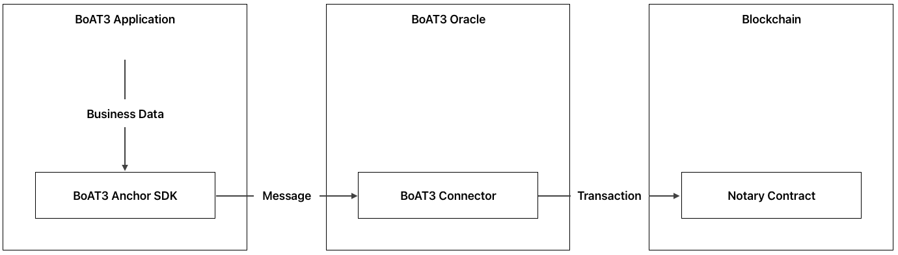

# BoAT3 Anchor SDK Guide

This guide is for developers of IoT + blockchain projects to attest and send data to blockchain via BoAT3 Connector. For simple, we use BoAT3 Application to replace "IoT + blockchain project" in the following chapters.


# Overview of BoAT3 Application

The simple architecture of BoAT3 Application looks like the following:



There are 3 key parts:
 - BoAT3 Application, collects business data, packs business data as BoAT3 messages and sends the packed message to the BoAT3 connector. A BoAT3 application can run on a single IoT device or a cloud server as will of developer.
 - BoAT3 Oracle, manages and hosts BoAT3 connectors. Every BoAT3 application has at least one BoAT3 connector. It is the bridge to the bockchain/contract.
 - Blockchain, provides notary contracts or services.


# Execution Environment

You need to install `Node.JS` execution environment. Check your `Node.JS` version to ensure that you have the latest version of `Node.JS` installed before proceeding. You can download the latest version of `Node.JS` at https://nodejs.org/en/download


# Request Authorization from BoAT3

Before sending data to BoAT3 Connector, you must an authorization issued by BoAT3. The authorization is a base64 encoded string that looks like:

eyJhY2NvdW50Ijp7ImF.....OWRiNzEzYTc4YmMxN2QwMzhiZSJ9fX0=

The lifetime of the authorization is limited. If you encounter the error message Authorization is expired, it indicates that the authorization has expired. In such cases, you can reach BoAT3 to request a new authorization.


# Preparing Business Data

You can prepare business data in any format and send it to BoAT3 Connector, but JSON format is preferred. Simple business data for the Weather Station looks like:

```
{
  uid: "0xaa3d6c4685940048fa6ece0ac9d3bc44914c2153d608b4052497129ac45f9c5b",
  temperature: 14,
  humidity: 70,
  cloud: 'sunny',
  latitude: 37.9,
  longitude: -120.4,
  timestamp: 1708853672789
}
```

# Install BoAT3 Anchor SDK

Currently, The BoAT3 Anchor SDK has yet to be published in `npm`, so you will need to install the BoAT3 Anchor SDK in a local way:

```
# Clone BoAT3-anchor-sdk repository
git clone https://github.com/aitos-io/BoAT3-anchor-sdk.git

cd BoAT3-anchor-sdk/

# Install dependencies
`npm` install
```

# Import BoAT3 Anchor SDK and Config Authorization

Every call to BoAT3 Anchor SDK needs authorization. The following sample code stores the authorization directly. The preferred way is using environment variables to manage the BoAT3 authorization.

```
const boat3 = require('BoAT3-anchor-sdk');

//set the BoAT3 authorzation in this constant
const BOAT3_AUTHORIZATION = "eyJhY2NvdW50Ijp7ImF.....OWRiNzEzYTc4YmMxN2QwMzhiZSJ9fX0=";
```


# Prepare BoAT3 Message

There are a lot of cryptographic processes for preparing BoAT3 messages, but it is very simple via BoAT3 Anchor SDK:

```
var message = await boat3.pack(businessData, BOAT3_AUTHORIZATION);
console.log(message);
```

BoAT3 Anchor SDK will take care of the message pack, digest calculate and sign things.


# Send Message to BoAT3 Connector

Send BoAT3 message to BoAT3 Connector. Every BoAT3 application must connect to a specific BoAT3 Connector. The base64 encoded authorization includes the configuration of target connector. The following is the sample code:

```
var result = await boat3.send(message, BOAT3_AUTHORIZATION);
console.log(result);
```

# Full BoAT3 Application Build

The remaining chapters describe a full BoAT3 application example. Developers can send any business data to the BoAT3 connector. The following takes Weather Station data as an example.

# Create and Initialize Your Application

Firstly, create and initialize your application:

```
# Create your BoAT3 application
mkdir /Path/To/Your-BoAT3-Application
cd /Path/To/Your-BoAT3-Application

# Initialize `npm` package
`npm` init

# Install BoAT3-anchor-sdk
`npm` install /Path/To/BoAT3-anchor-sdk
```

# Source Code of Your BoAT3 Application

Secondly, create an entrypoint of your application:

```
touch app.js
```

Copy and paste the following code in `app.js`:

```
const boat3 = require('BoAT3-anchor-sdk');

//put the authorzation issued by BoAT3 in here
const BOAT3_AUTHORIZATION = "___replace_later___";

(async function() {
    var businessData = {
    uid: "0xaa3d6c4685940048fa6ece0ac9d3bc44914c2153d608b4052497129ac45f9c5b",
    temperature: 14,
    humidity: 70,
    cloud: 'sunny',
    latitude: 37.9,
    longitude: -120.4,
    timestamp: 1708853672789
  };

  var message = await boat3.pack(businessData, BOAT3_AUTHORIZATION);
  console.log(message);

  var result = await boat3.send(message, BOAT3_AUTHORIZATION);
  console.log(result);
        
})();
```

Replace the value of constant variable `BOAT3_AUTHORIZATION` with the BoAT3 authorization issued by BoAT3:

```
const BOAT3_AUTHORIZATION = "eyJhY2NvdW50Ijp7ImF.....OWRiNzEzYTc4YmMxN2QwMzhiZSJ9fX0=";
```

# Start Your BoAT3 Application

```
node app.js
```
